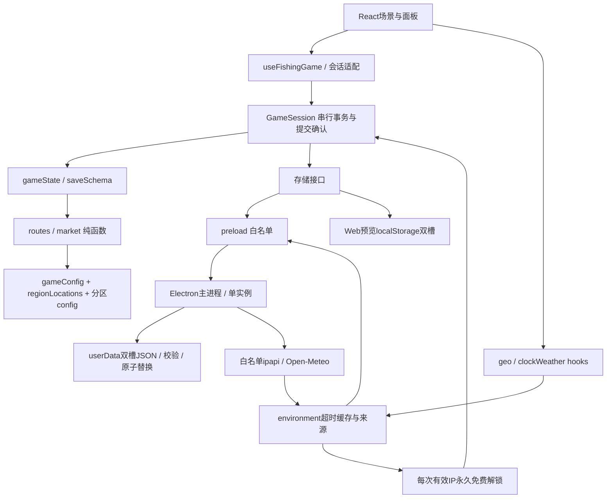
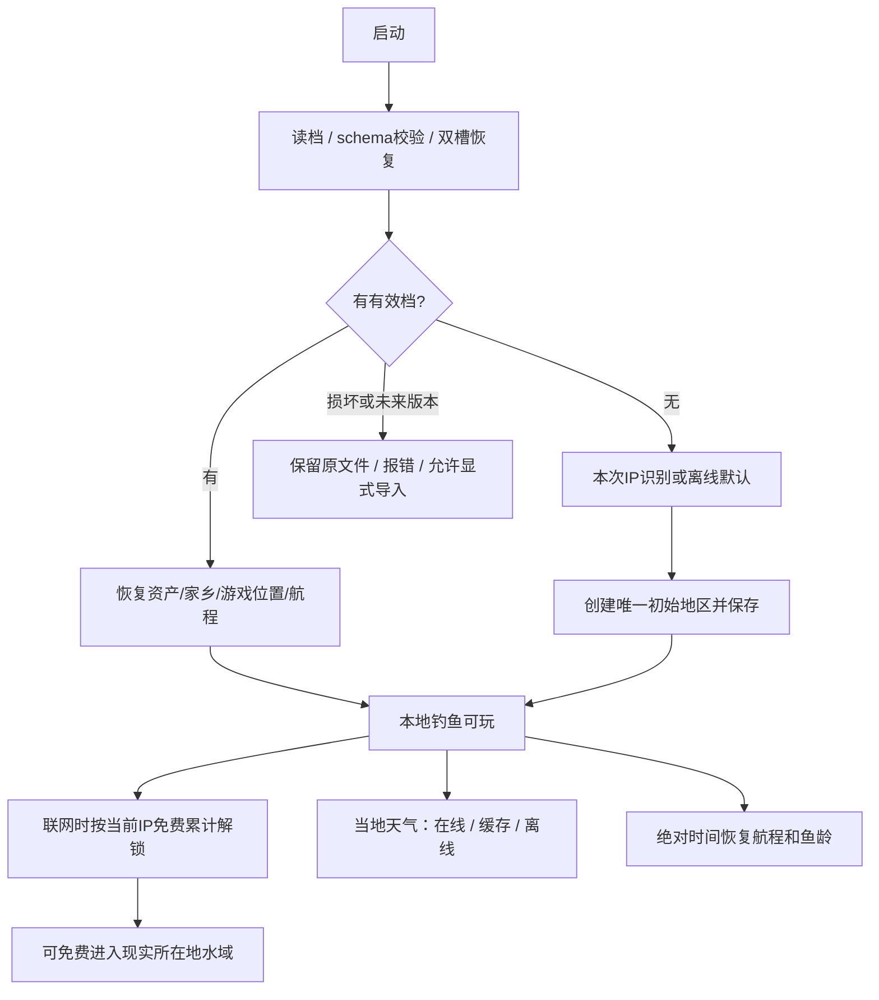
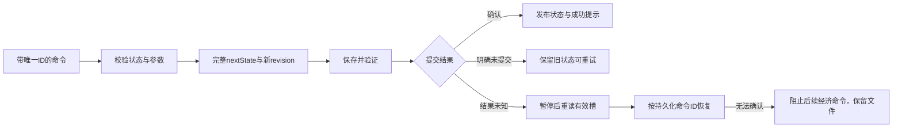
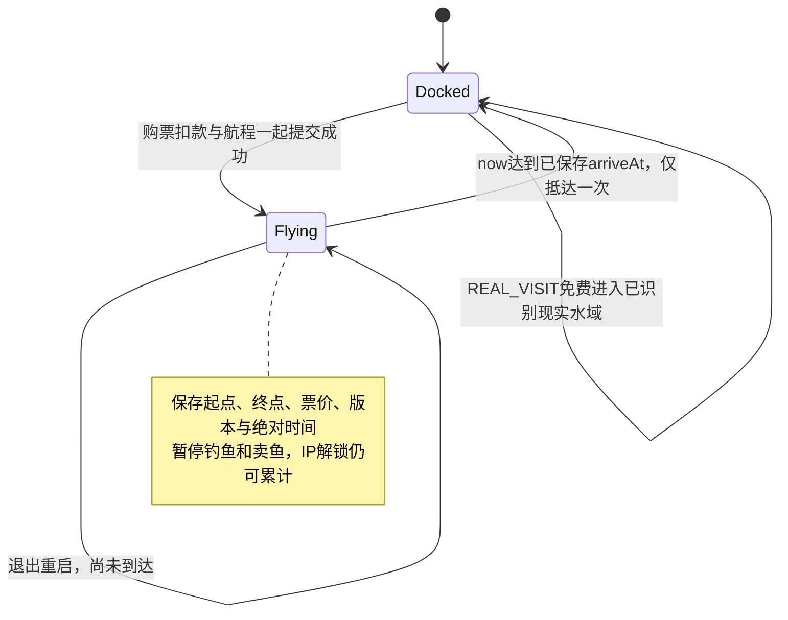
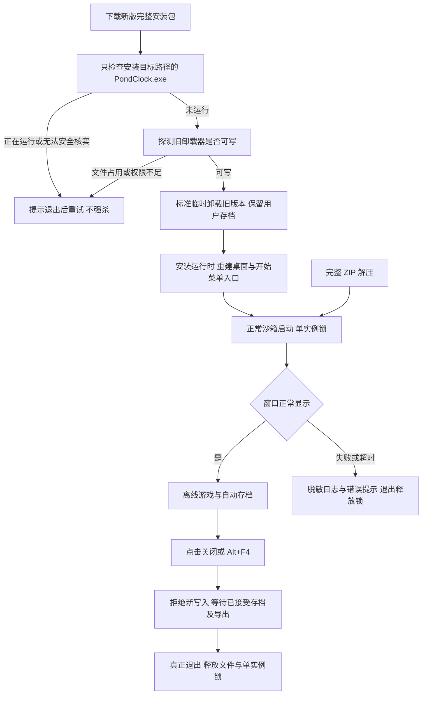

# 实现架构与流程

```mermaid
flowchart TD
  UI[React场景与面板] --> HOOK[useFishingGame / 会话适配]
  HOOK --> SESSION[GameSession 串行事务与提交确认]
  SESSION --> STATE[gameState / saveSchema]
  STATE --> RULES[routes / market 纯函数]
  RULES --> DATA[gameConfig + regionLocations + 分区config]
  SESSION --> REPO[存储接口]
  REPO --> BRIDGE[preload 白名单]
  BRIDGE --> MAIN[Electron主进程 / 单实例]
  MAIN --> SAVE[userData双槽JSON / 校验 / 原子替换]
  REPO --> WEB[Web预览localStorage双槽]
  UI --> ENV[geo / clockWeather hooks]
  ENV --> SERVICE[environment超时缓存与来源]
  SERVICE --> BRIDGE
  MAIN --> NET[白名单ipapi / Open-Meteo]
  NET --> SERVICE
  SERVICE --> GEO[每次有效IP永久免费解锁]
  GEO --> SESSION
```

```mermaid
flowchart TD
  START[启动] --> LOAD[读档 / schema校验 / 双槽恢复]
  LOAD --> VALID{有有效档?}
  VALID -->|有| RESTORE[恢复资产/家乡/游戏位置/航程]
  VALID -->|无| GEO[本次IP识别或离线默认]
  VALID -->|损坏或未来版本| KEEP[保留原文件 / 报错 / 允许显式导入]
  GEO --> NEW[创建唯一初始地区并保存]
  RESTORE --> PLAY[本地钓鱼可玩]
  NEW --> PLAY
  PLAY --> IP[联网时按当前IP免费累计解锁]
  IP --> REAL[可免费进入现实所在地水域]
  PLAY --> WEATHER[当地天气：在线 / 缓存 / 离线]
  PLAY --> TIME[绝对时间恢复航程和鱼龄]
```

```mermaid
flowchart LR
  CMD[带唯一ID的命令] --> CHECK[校验状态与参数]
  CHECK --> NEXT[完整nextState与新revision]
  NEXT --> SAVE[保存并验证]
  SAVE --> RESULT{提交结果}
  RESULT -->|确认| PUBLISH[发布状态与成功提示]
  RESULT -->|明确未提交| OLD[保留旧状态可重试]
  RESULT -->|结果未知| READ[暂停后重读有效槽]
  READ --> ID[按持久化命令ID恢复]
  ID -->|无法确认| BLOCK[阻止后续经济命令，保留文件]
```

```mermaid
stateDiagram-v2
  [*] --> Docked
  Docked --> Flying: 购票扣款与航程一起提交成功
  Flying --> Flying: 退出重启，尚未到达
  Flying --> Docked: now达到已保存arriveAt，仅抵达一次
  Docked --> Docked: REAL_VISIT免费进入已识别现实水域
  note right of Flying
    保存起点、终点、票价、版本与绝对时间
    暂停钓鱼和卖鱼，IP解锁仍可累计
  end note
```
# 1.0.1 安装、启动与退出补充

```mermaid
flowchart TD
  A[下载新版完整安装包] --> B[只检查安装目标路径的 PondClock.exe]
  B -->|正在运行或无法安全核实| C[提示退出后重试 不强杀]
  B -->|未运行| D[探测旧卸载器是否可写]
  D -->|文件占用或权限不足| C
  D -->|可写| E[标准临时卸载旧版本 保留用户存档]
  E --> F[安装运行时 重建桌面与开始菜单入口]
  F --> G[正常沙箱启动 单实例锁]
  G --> H{窗口正常显示}
  H -->|是| I[离线游戏与自动存档]
  H -->|失败或超时| J[脱敏日志与错误提示 退出释放锁]
  I --> K[点击关闭或 Alt+F4]
  K --> L[拒绝新写入 等待已接受存档及导出]
  L --> M[真正退出 释放文件与单实例锁]
  Z[完整 ZIP 解压] --> G
```

此图描述修复后的实现设计。真实安装、升级与正常沙箱运行的通过情况以 [修复验收](REPAIR_ACCEPTANCE.md) 为准，设计图不能代替实测结果。
